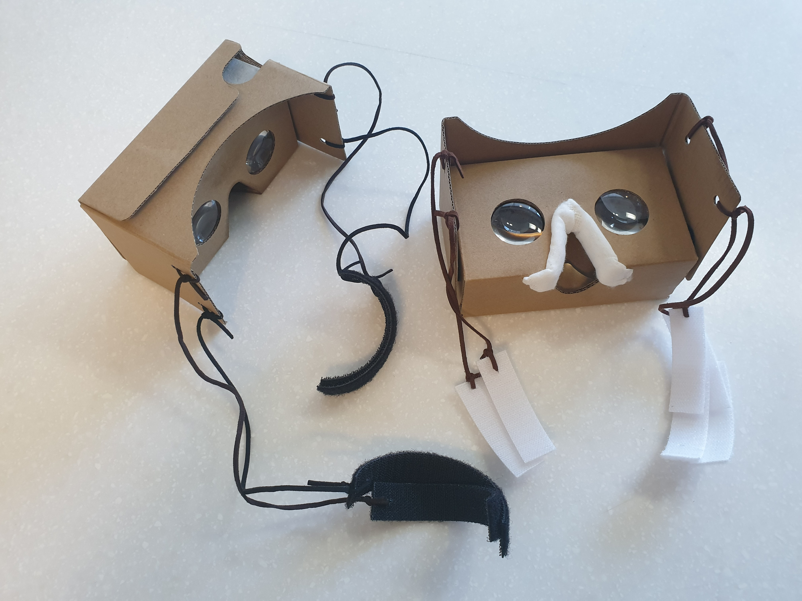

# TEAM 401

> [Εἰρήνη (Eirene)](http://j4a401.p.ssafy.io/)🦌 
>
> 에이레네(그리스어: Εἰρήνη , 에이리니, 라틴어: Eirene)는 그리스 신화에 등장하는 평화의 여신이다.

### Members 👨‍👩‍👦‍👦

### Project Info

- Project Purpose

  마음의 여유가 없는 현대인들에게 안식처를 제공하는 VR서비스 입니다.
  
- Download

  <a href="https://eirenebucket.s3.ap-northeast-2.amazonaws.com/Eirene_final_ver.apk">Download 받기</a>

- Duration

  March 1st 2021 ~ April 9th 2021

- Tech Stack

  

- Map Detail

  - Orange

    - Orange 맵은 가을의 숲을 배경으로 한 `탄생의 가을숲`으로 경쾌하고 낙천적인 기질을 가진 사람들을 위한 인터렉션을 배치하였다.

    

  - Yellow

    - Yellow 맵은 `황금의 방`으로 논리와 분석을 통해 다른 공간으로 이동 가능하도록 하는 인터렉션을 넣어 재미를 느끼도록 하였다.

    

  - Green

    - Green 맵은 `자연속 산책`으로 자연 속에서 평안과 균형을 느낄 수 있는 인터렉션을 넣어 사용자가 휴식의 느낌을 갖도록 하였다.

    

  - Blue

    - Blue 맵은 `바닷 속 난파선`으로 뛰어난 통찰력을 가지고 있고 어려운 일을 수월하게 해내는 기질을 가진 사람들을 위해 퀴즈를 풀어 보상을 얻을 수 있는 인터렉션을 배치하였다.

    

  - Navy

    - Navy 맵은 `신비한 밤바다`로 정신적을 면을 중시하고 일상과 현실의 평범함의 중요성을 강조하는 인터렉션을 배치하여 자신감을 갖도록 유도하는 인터렉션을 배치하였다.

    

  - Purple

    - Purple 맵은 `거울 호수`로 신비함과 정신적 세계에 관심이 많은 사람들에게 신비로운 경험을 할 수 있는 인터렉션을 배치하여 흥미를 주도록 하였다.

    

  - Pink

    - Pink 맵은 `벚꽃 사막`으로 분홍 빛 사막 속 벚꽃을 배치하여 행동에 따라 신비롭고 편안함을 주는 인터렉션을 배치하여 타인에게 에너지를 쓰는 기질의 사람들에게 휴식의 느낌을 주도록 하였다.  

    

- Multibus

  - 멀티버스 맵에서 다른 유저와 멀티플레이 가능

    

#### Usage

- Apk 파일 설치

  

  1. 설정에서 애플리케이션을 선택합니다.
  2. 에이레네 선택 후 권한 탭으로 이동합니다.
  3. 마이크에서 허용을 선택합니다.
  4. 저장공간에서 허용을 선택합니다.

- Webcam

  - Webcam을 사용하여 모션 인식 인터렉션을 사용할 수 있습니다.

  

- Google Cardboard

  - Cardboard를 사용하여 플레이 가능합니다.

  

### Tech log :bookmark:

Personal Goal and Summary

    <ul>
        <a href="Document/Tech_Log/Personal_Goal/Personal_Goal.md"><li>개인목표정리</li></a>
        <a href="Document/Tech_Log/Personal_Goal/Develop_Summary_Sanghun.md"><li>신상훈 개발일지</li></a>
        <a href="Document/Tech_Log/Personal_Goal/Develop_Summary_HaeSung.md"><li>강해성 개발일지</li></a>
        <a href="Document/Tech_Log/Personal_Goal/Develop_Summary_SoHyun.md"><li>박소현 개발일지</li></a>
        <a href="Document/Tech_Log/Personal_Goal/Develop_Summary_CheongHwa.md"><li>김청화 개발일지</li></a>
        <a href="Document/Tech_Log/Personal_Goal/Develop_Summary_Mintak.md"><li>오민택 개발일지</li></a>
    </ul>

Scrum

    <ul>
       <a href="https://www.notion.so/VR-Project-6dd9383ec0974b4a829eaadfd35dad4a"><li>Scrum Page</li></a> 
    </ul>

WireFrame

    <ul>
    <a href="https://jamboard.google.com/d/1xGNY3oLmgPtqpQzj2twDg86FApMhfrF4hfhbUQ7pGvs/edit?usp=sharing"><li>와이어프레임</li></a>
    </ul>

PPT, 영상

    <ul>
      <a href="https://jamboard.google.com/d/1xGNY3oLmgPtqpQzj2twDg86FApMhfrF4hfhbUQ7pGvs/edit?usp=sharing"><li>PPT</li></a>
    </ul>
    <ul>
        <a href=""><li>영상</li></a>
    </ul>

