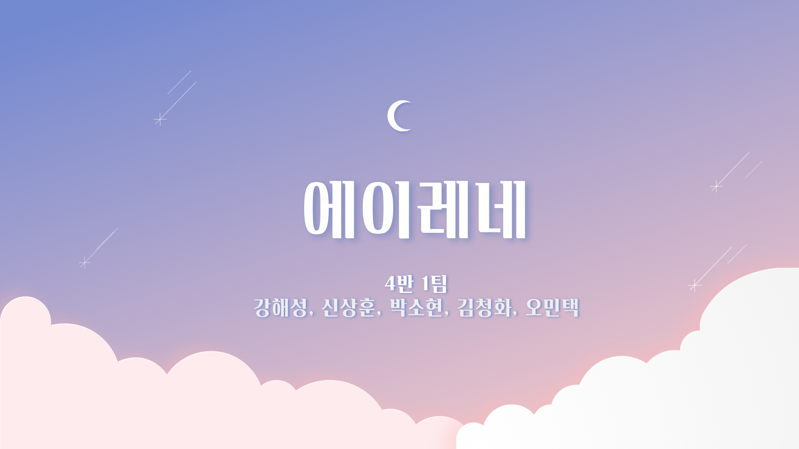
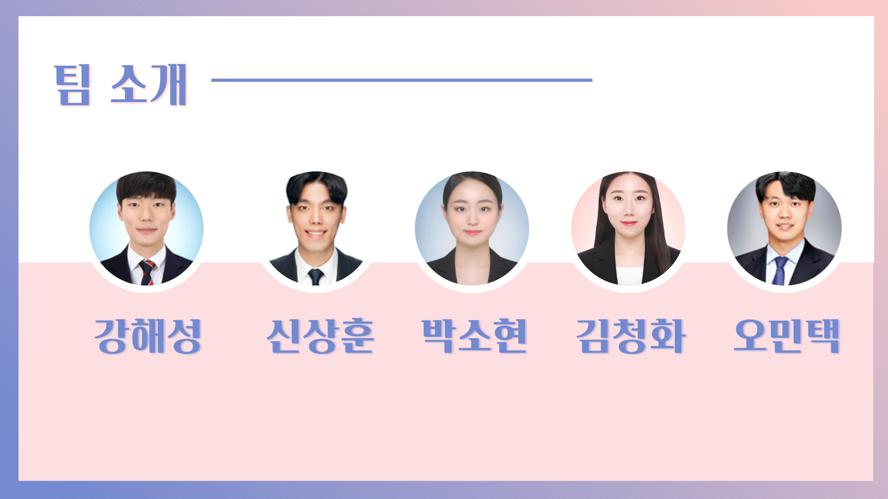
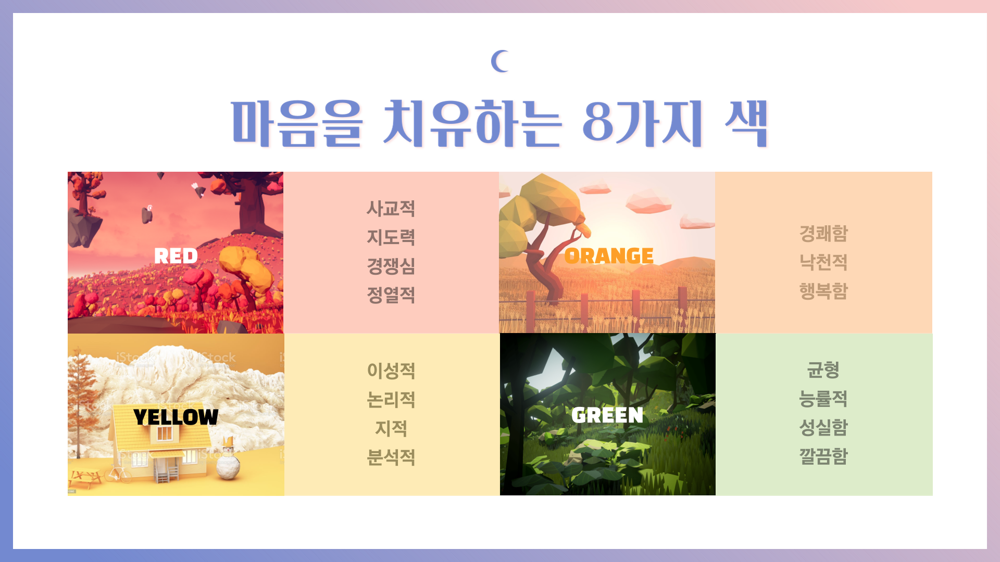
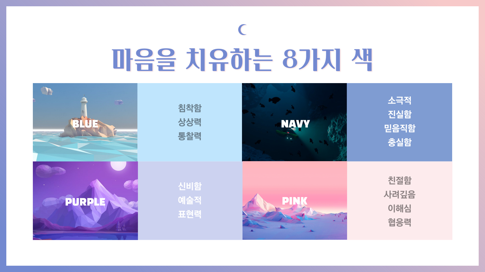
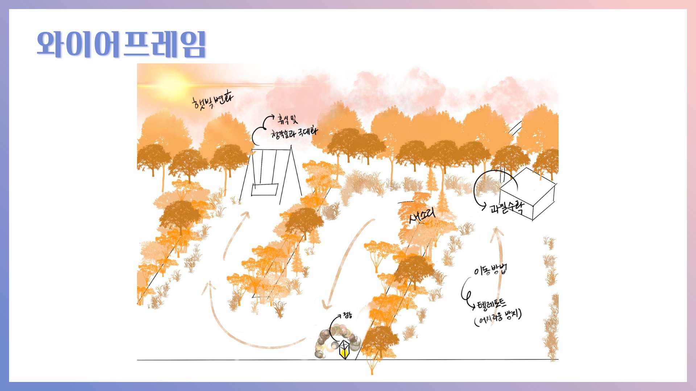
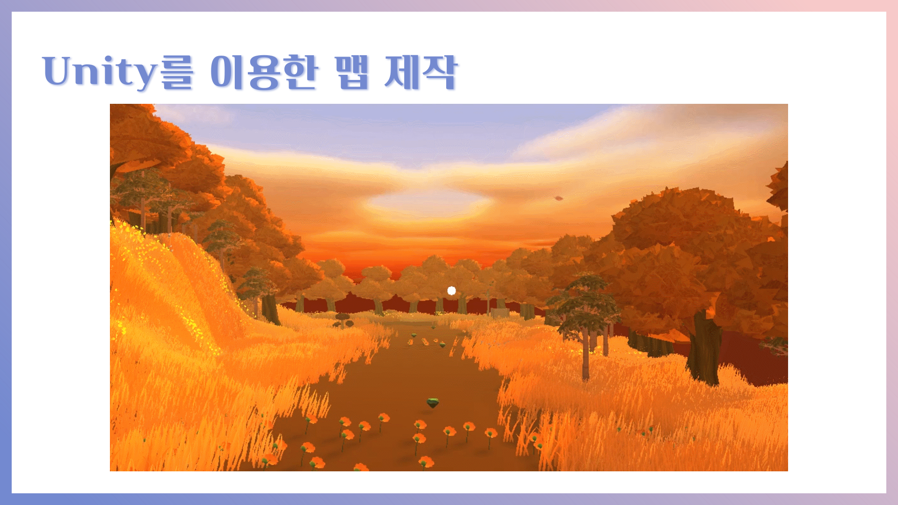

# TEAM 401

> [Εἰρήνη (Eirene)](http://j4a401.p.ssafy.io/)🦌
>
> 에이레네(그리스어: Εἰρήνη , 에이리니, 라틴어: Eirene)는 그리스 신화에 등장하는 평화의 여신이다.

### Members 👨‍👩‍👦‍👦

### Project Description

> 마음의 여유가 없는 현대인들에게 안식처를 제공하는 VR서비스 입니다

#### Color Concept

### WireFrame 🎲

> Orange

#### In  Service

> example

### Our Notion 🔮

🎈[Notion](https://www.notion.so/VR-Project-6dd9383ec0974b4a829eaadfd35dad4a)

### Tech log :bookmark:

Personal Goal and Summary

    <ul>
        <a href="Document/Tech_Log/Personal_Goal/Personal_Goal.md"><li>개인목표정리</li></a>
        <a href="Document/Tech_Log/Personal_Goal/Develop_Summary_Sanghun.md"><li>신상훈 개발일지</li></a>
        <a href="Document/Tech_Log/Personal_Goal/Develop_Summary_HaeSung.md"><li>강해성 개발일지</li></a>
        <a href="Document/Tech_Log/Personal_Goal/Develop_Summary_SoHyun.md"><li>박소현 개발일지</li></a>
        <a href="Document/Tech_Log/Personal_Goal/Develop_Summary_CheongHwa.md"><li>김청화 개발일지</li></a>
        <a href="Document/Tech_Log/Personal_Goal/Develop_Summary_Mintak.md"><li>오민택 개발일지</li></a>
    </ul>

Scrum

    [스크럼페이지](https://www.notion.so/032f47a64af643cba01edfe24a71b718?v=e42bfeeb73ea41a1a53c8ca7e761167a)

Project Proposal and WireFrame

    <ul>
        <a href=""><li>프로젝트 기획안</li></a>
    <a href="https://jamboard.google.com/d/1xGNY3oLmgPtqpQzj2twDg86FApMhfrF4hfhbUQ7pGvs/edit?usp=sharing"><li>와이어프레임</li></a>
    </ul>

Video Proposal

    <ul>
        <a href=""><li>영상기획안</li></a>
    </ul>
    <ul>
        <a href=""><li>PPT</li></a>
    </ul>

